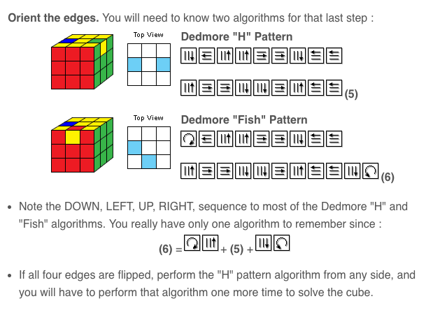

# rubiks-instructions

Rubik’s cube

1. Solve one side and hold that on the top of the cube

 Suppose one of the corners you need is on the bottom, right below where it should go.  Depending on which way the piece is facing, there are basically two ways of getting that corner: a right-pickup or a front-pickup.  Suppose the piece is on the right side (the piece you want is on the bottom-right, you want to move it to the top-right).  
If the color you want on top is facing you, you can do a front-pickup: front-clockwise, bottom-right, front-counter.  Or you can do: bottom-left, right-down, bottom-right, right-up.  
If the color you want is on the right face, you can do a right-pickup: right-down, bottom-left, right-up.  

 The ideas of front-drop, front-pickup, right-drop, right-pickup aren’t quite formal, but I use them as ways of remembering the rest of the algorithms, which are more complicated.  In most cases, you displace (drop) a piece from the now-solved top row, and you follow that piece around a bit, then you pickup that piece to restore it to the top row again.  

1. Next, do the remaining edges of the second row. Put the matching piece in the third row as close as it can go. Suppose it's on the left of where it should go:
Bottom-left.  Right-down, bottom-left, right-up.  Bottom-right.  Front clockwise, bottom right, front counter. 
That's like saying doing a right drop the do a front pickup

3. Next, move the bottom row corners into place. This swaps the near corners: 
Right-down, bottom-left, right-up.  front-clockwise, bottom-right, front-counter.  right-down, bottom-right, right-up. bottom-left, bottom-left.  

 This is like down a right-drop, then a front drop, then a right-pickup.

4. Next, orient the bottom corners.  This turns three of the corners:
Right-down, bottom-left, right-up, bottom-left, right-down, bottom-left, bottom-left, right-up, bottom-left, bottom-left
This is like a right-drop, bottom-left, and a right-pickup that requires two bottom-lefts to do the pickup, then two bottom-lefts at the end.  

5. Next, move the bottom edges. 
Middle-down, bottom-left, middle-up.  Bottom-right, bottom-right.  Middle-down, bottom-left, middle-up

 You can think of this as dropping the middle center piece to the left, moving it to the other side, then picking it up again from the right.  

6. Finally, orient the bottom corners.  There are two algorithms for this -- one if the edges that need to be fixed are across from each other, one if they are next to each other (at a 90 degree angle).  I only remember one, the one where they are across from each other.  I think if you need the other, you can do a series of bottom-edge rotations (step 5) until you need this one.  

 Middle-down, bottom-left, middle-up, bottom-left, middle-down, bottom-left (this one doesn’t move the original piece), middle-up, bottom-left, middle-down, bottom-left, middle-up

 You can think of this as dropping the middle piece to the left, and repeatedly moving that piece around the bottom until you pick it up again.  

 http://www.wikihow.com/Solve-a-Rubik's-Cube-(Easy-Move-Notation)

 Here’s the other one, aka the Dedmore “H” algorithm:

 Hold the cube with the H on the top, so you are looking at one of the pieces you need to flip.  Then do:
Middle-up, top-right, middle-up, top-right, middle-up, top-left, top-left
Middle-down, top-right, middle-down, top-right, middle-down, top-left, top-left

 http://s235.photobucket.com/user/sunnythellama/media/fishh.jpg.html

